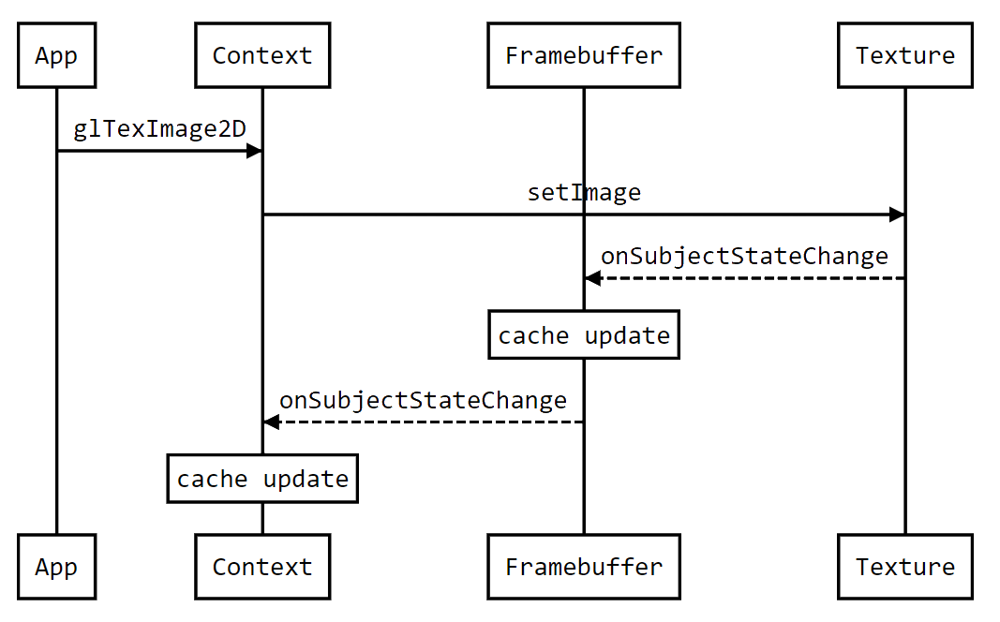

# Dirty Bits and State Changes

OpenGL render loops typically involve changing some render states followed by
a draw call. For instance the app might change a few uniforms and invoke
`glDrawElements`:

```
for (const auto &obj : scene) {
    for (const auto &uni : obj.uniforms) {
        glUniform4fv(uni.loc, uni.data);
    }
    glDrawElements(GL_TRIANGLES, obj.eleCount, GL_UNSIGNED_SHORT, obj.eleOffset);
}
```

Another update loop may change Texture and Vertex Array state before the draw:

```
for (const auto &obj : scene) {
    glBindBuffer(GL_ARRAY_BUFFER, obj.arrayBuffer);
    glBufferSubData(GL_ARRAY_BUFFER, obj.bufferOffset, obj.bufferSize, obj.bufferData);
    glVertexAttribPointer(obj.arrayIndex, obj.arraySize, GL_FLOAT, GL_FALSE, 0, nullptr);
    glBindTexture(GL_TEXTURE_2D, obj.texture);
    glDrawElements(GL_TRIANGLES, obj.eleCount, GL_UNSIGNED_SHORT, obj.eleOffset);
}
```

Other update looks may change render states like the blending modes, the depth
test, or Framebuffer attachments. In in each case ANGLE needs to validate,
track, and translate these state changes to the back-end as efficiently as
possible.

## Dirty Bits

Each OpenGL Context state value is stored in
[`gl::State`](../src/libANGLE/State.h). For instance the blending state,
depth/stencil state, and current object bindings. Our problem is deciding how
to notify the back-end when app changes front-end state. We decided to bundle
changed state into bitsets. Each 1 bit indicates an specific changed state
value. We call these bitsets "*dirty bits*". See
[`gl::State::DirtyBitType`](https://chromium.googlesource.com/angle/angle/+/5f662c0042703344eb0eef6d1c123e902e3aefbf/src/libANGLE/State.h#483).

Each back-end handles state changes in a `syncState` implementation function that takes a
dirty bitset. See examples in the
[GL back-end](https://chromium.googlesource.com/angle/angle/+/5f662c0042703344eb0eef6d1c123e902e3aefbf/src/libANGLE/renderer/gl/StateManagerGL.cpp#1576),
[D3D11 back-end](https://chromium.googlesource.com/angle/angle/+/5f662c0042703344eb0eef6d1c123e902e3aefbf/src/libANGLE/renderer/d3d/d3d11/StateManager11.cpp#852)
and [Vulkan back-end](https://chromium.googlesource.com/angle/angle/+/5f662c0042703344eb0eef6d1c123e902e3aefbf/src/libANGLE/renderer/vulkan/ContextVk.cpp#642).

Container objects such as Vertex Array Objects and Framebuffers also have their own
OpenGL front-end state.
[VAOs](https://chromium.googlesource.com/angle/angle/+/5f662c0042703344eb0eef6d1c123e902e3aefbf/src/libANGLE/VertexArray.h#35)
store vertex arrays and array buffer bindings.
[Framebuffers](https://chromium.googlesource.com/angle/angle/+/5f662c0042703344eb0eef6d1c123e902e3aefbf/src/libANGLE/Framebuffer.h#52)
store attachment state and the active read and rraw buffers. These containers
also have internal dirty bits and `syncState` methods. See
[`gl::Framebuffer::DirtyBitType`](https://chromium.googlesource.com/angle/angle/+/5f662c0042703344eb0eef6d1c123e902e3aefbf/src/libANGLE/Framebuffer.h#319) and
[`rx::FramebufferVk::syncState`](https://chromium.googlesource.com/angle/angle/+/5f662c0042703344eb0eef6d1c123e902e3aefbf/src/libANGLE/renderer/vulkan/FramebufferVk.cpp#726) for example.

Dirty bits allow us to efficiently process groups of state updates. We use
fast instrinsic functions to scan the bitsets for 1 bits. See
[`bitset_utils.h`](../src/common/bitset_utils.h) for more information.

## Cached Validation and State Change Notifications

To optimize validation we cached many checks. See
[`gl::StateCache`](https://chromium.googlesource.com/angle/angle/+/5f662c0042703344eb0eef6d1c123e902e3aefbf/src/libANGLE/Context.h#98)
for examples. We need to refresh cached values on state changes. Changing
vertex array forces a refresh of the cached list of active attributes.
Changing Texture storage can refresh cached Framebuffer
completeness checks if the Texture is bound as an attachment. This in
turn can force a refresh of cached draw call validation in the Context.

<!-- Generated from https://bramp.github.io/js-sequence-diagrams/
participant App
participant Context
participant Framebuffer
participant Texture
App->Context: glTexImage2D
Context->Texture: setImage
Texture- ->Framebuffer: onSubjectStateChange
Note over Framebuffer: cache update
Framebuffer- ->Context: onSubjectStateChange
Note over Context: cache update
-->




